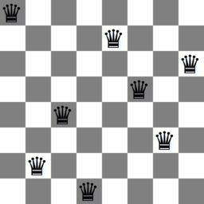

# N-Queens Puzzle Solver Using Memetic Algorithm


This Jupyter Notebook contains Python code for solving the N-Queens puzzle using a memetic algorithm. The N-Queens puzzle is a classic combinatorial problem where the goal is to place N chess queens on an N×N chessboard so that no two queens threaten each other. In other words, no two queens can share the same row, column, or diagonal.

## Table of Contents
- [Introduction](#introduction)
- [Getting Started](#getting-started)
- [Dependencies](#dependencies)
- [Usage](#usage)
- [Algorithm Overview](#algorithm-overview)
- [Parameter Customization](#parameter-customization)
- [Results](#results)
- [Visualization](#visualization)

## Introduction

The N-Queens puzzle is a well-known problem in computer science and combinatorial optimization. It challenges you to place N chess queens on an N×N chessboard in such a way that no two queens threaten each other. A queen can attack other pieces in the same row, column, or along diagonals.

This notebook provides an implementation of a memetic algorithm to find solutions to the N-Queens puzzle. The algorithm uses a combination of genetic algorithm techniques and local search to explore the solution space and find optimal configurations.

## Getting Started

To get started, clone this repository to your local machine and open the Jupyter Notebook (`N_Queens_Puzzle_Solver.ipynb`) using Jupyter Notebook or Jupyter Lab.

```
git clone <repository_url>
cd <repository_folder>
jupyter notebook N_Queens_Puzzle_Solver.ipynb
```
## Dependencies

Ensure you have the following Python libraries installed:

```
pip install numpy pandas more_itertools matplotlib
```
## Usage
## Running the Algorithm

To solve the N-Queens puzzle, execute the code cells in the Jupyter Notebook. You can customize various parameters to solve the puzzle for different board sizes and algorithm configurations.

## Algorithm Overview

The algorithm implemented in this notebook consists of several key components:

- **Fitness Function**: Calculates the number of conflicts between queens on the chessboard, with the goal of minimizing conflicts.
- **Initialization**: Initializes a population of solutions, where each solution represents a placement of queens on the board.
- **Parent Selection**: Selects parents from the population based on their fitness using truncation selection.
- **Crossover**: Combines two parent solutions to create a child solution while maintaining solution validity.
- **Mutation**: Introduces diversity by mutating a portion of child solutions through position swaps.
- **Local Search**: Applies local search to some children, generating neighbors and selecting the neighbor with the best fitness.
- **Replacement**: Retains the best solutions from parents, children, and local search to form the next generation.
- **Termination**: The algorithm continues to iterate until a solution with zero conflicts (a solution to the puzzle) is found or until a maximum number of iterations is reached.

## Parameter Customization

You can customize various parameters of the algorithm to suit your specific requirements:

- `N`: The size of the chessboard (N×N).
- `population`: The initial population size.
- `T`: The percentage of population chosen randomly as parents.
- `parents_percent`: The percentage of the population chosen as parents.
- `children_percentage`: The percentage of children generated from parents.
- `mutation_percentage`: The percentage of children subjected to mutation.
- `local_search_percentage`: The percentage of children undergoing local search.
- `neighbor_percentage`: The percentage of neighbors generated for each child during local search.

## Viewing Results

After running the code, you will see the final solution and the fitness value (number of conflicts). This information helps you verify the correctness of the solution.

## Visualization

For smaller board sizes (N=7 and N=20), the code includes an option to generate plots that visualize the chessboard with queens placed in their final positions. These plots offer a visual representation of the solutions.
